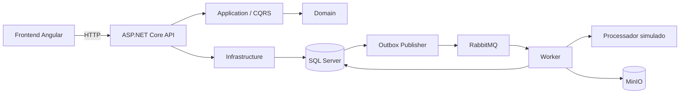

# Documentação técnica do TreasuryFlow — V1

## 1. Objetivo deste documento

Este documento descreve a primeira versão do TreasuryFlow conforme o código existente no repositório. Ele explica o problema resolvido, as decisões arquiteturais, o fluxo de uma ordem de pagamento, a responsabilidade de cada projeto e a forma de executar e validar a aplicação.

A V1 é um projeto de estudo arquitetural. Seu objetivo é ser coerente, funcional, executável, testada e explicável. Ela não deve ser interpretada como uma plataforma pronta para produção.

O nome V1 identifica o estado documentado neste momento; ele não representa um congelamento funcional. Este documento deverá acompanhar a evolução do projeto e ser atualizado quando novas entregas forem incorporadas.

## 2. O que a aplicação faz

O TreasuryFlow acompanha o ciclo de vida de ordens de pagamento.

Uma pessoa pode:

1. criar uma ordem como rascunho;
2. consultar a ordem pelo identificador;
3. editar seus dados enquanto ela ainda estiver em rascunho;
4. submeter a ordem para processamento;
5. acompanhar automaticamente a evolução do processamento;
6. cancelar uma ordem que ainda esteja em rascunho ou pendente;
7. visualizar o resultado final em caso de conclusão ou falha.

O processamento financeiro da V1 é simulado. Quando uma ordem é aprovada, o Worker também grava um comprovante JSON no MinIO.

## 3. Visão geral da arquitetura



O desenho combina Clean Architecture, Domain-Driven Design e CQRS. A regra mais importante é que as regras de negócio ficam no centro e não dependem de banco de dados, HTTP, RabbitMQ ou MinIO.

### Direção das dependências

```text
Domain <- Application <- API
   ^           ^
   |           |
   +------ Infrastructure <- Worker

Contracts é compartilhado entre publicação e consumo de eventos.
Web conversa com a API somente por HTTP.
```

Uma camada externa pode conhecer uma camada interna. A camada interna não deve conhecer detalhes externos. Assim, o Aggregate `PaymentOrder` não precisa saber que é salvo no SQL Server ou que um evento será publicado no RabbitMQ.

## 4. Projetos e responsabilidades

### `TreasuryFlow.Domain`

Contém o núcleo do negócio:

- Aggregate `PaymentOrder`;
- enum `PaymentOrderStatus`;
- Value Object `Money`;
- evento de domínio `PaymentOrderSubmittedDomainEvent`;
- exceção de domínio;
- contrato do repositório.

O Domain decide se uma operação é válida. Nenhuma camada externa deve contornar suas invariantes.

### `TreasuryFlow.Application`

Contém os casos de uso da aplicação:

- criar ordem;
- editar ordem;
- consultar por ID;
- submeter ordem;
- cancelar ordem.

MediatR separa a intenção, representada por Command ou Query, do Handler que a executa. FluentValidation valida a forma da entrada antes que o Handler seja chamado. O `ValidationBehavior` aplica essa validação como parte do pipeline do MediatR.

As interfaces `IPaymentProcessor` e `IPaymentReceiptStorage` são portas: a Application define de que capacidade precisa, enquanto a Infrastructure escolhe como fornecê-la.

### `TreasuryFlow.Contracts`

Contém o contrato do evento de integração `PaymentOrderSubmittedIntegrationEvent`. O contrato é independente do evento de domínio porque uma mensagem pública não deve depender diretamente da representação interna do Aggregate.

### `TreasuryFlow.Infrastructure`

Implementa detalhes técnicos:

- Entity Framework Core e SQL Server;
- repositório de ordens;
- migrations;
- Outbox e Inbox;
- publicação e consumo com RabbitMQ;
- política de retry e fila de falhas;
- processador de pagamentos simulado;
- armazenamento de comprovantes no MinIO.

### `TreasuryFlow.Api`

É a porta HTTP. Recebe requests, cria Commands ou Queries, envia-os pelo MediatR e converte o resultado para respostas HTTP.

Também fornece:

- Problem Details para erros;
- documento OpenAPI no ambiente Development;
- health checks de liveness e readiness;
- aplicação opcional de migrations na inicialização.

### `TreasuryFlow.Worker`

É o processo em segundo plano responsável por consumir a fila do RabbitMQ. Ele executa as mudanças internas `Pending -> Processing -> Completed/Failed` e grava o comprovante de uma ordem aprovada.

As transições internas não são endpoints públicos. Isso impede que um cliente externo marque artificialmente uma ordem como processada, concluída ou falha.

### `TreasuryFlow.Web`

É o frontend Angular standalone. Ele possui telas para criação, edição, consulta e acompanhamento da ordem. O frontend usa a API; ele não acessa diretamente SQL Server, RabbitMQ ou MinIO.

### Projetos de testes

- `TreasuryFlow.Domain.UnitTests`: regras puras do domínio;
- `TreasuryFlow.Application.UnitTests`: Commands, Queries, Handlers, validators e pipeline;
- `TreasuryFlow.Infrastructure.IntegrationTests`: integração entre persistência e componentes da Infrastructure usando SQLite em memória e substitutos controlados; também cobre políticas e registros de RabbitMQ e MinIO, sem iniciar esses serviços reais;
- `TreasuryFlow.Api.IntegrationTests`: contrato HTTP, erros e health checks;
- arquivos `*.spec.ts` no projeto Web: componentes e serviços Angular.

## 5. Modelo de domínio

### Aggregate `PaymentOrder`

O Aggregate é a fronteira que protege a consistência de uma ordem. Suas propriedades possuem setters privados, portanto alterações precisam passar por comportamentos públicos como `UpdateDetails()`, `Submit()` e `Cancel()`.

Uma nova ordem recebe:

- `Id` em formato GUID;
- status `Draft`;
- `CreatedAt` em UTC;
- descrição, valor, moeda e beneficiário validados.

### Regras dos textos

- descrição obrigatória, normalizada com `Trim()` e limitada a 200 caracteres;
- beneficiário obrigatório, normalizado com `Trim()` e limitado a 150 caracteres;
- edição permitida somente no estado `Draft`.

As limitações existem no Domain e também são antecipadas pelos validators da Application. O validator oferece uma resposta amigável; o Domain continua sendo a última proteção, inclusive quando for chamado por outro tipo de entrada no futuro.

### Value Object `Money`

`Money` combina valor e moeda em um único conceito e garante:

- valor maior que zero;
- no máximo duas casas decimais;
- moeda obrigatória e normalizada para letras maiúsculas;
- suporte, na V1, somente a `BRL`, `USD` e `EUR`.

Por ser um record, sua igualdade é baseada nos valores. Dois objetos com o mesmo valor e a mesma moeda representam o mesmo dinheiro.

## 6. Máquina de estados

| Estado atual | Operação | Próximo estado | Quem executa |
|---|---|---|---|
| nenhum | criar | `Draft` | cliente pela API |
| `Draft` | editar | `Draft` | cliente pela API |
| `Draft` | submeter | `Pending` | cliente pela API |
| `Draft` | cancelar | `Cancelled` | cliente pela API |
| `Pending` | cancelar | `Cancelled` | cliente pela API |
| `Pending` | iniciar processamento | `Processing` | Worker |
| `Processing` | aprovar | `Completed` | Worker |
| `Processing` | rejeitar | `Failed` | Worker |

`Completed`, `Failed` e `Cancelled` são estados finais na V1.

### Por que “excluir” cancela em vez de apagar

Na interface, a ação pode ser apresentada como exclusão quando a ordem ainda é um rascunho. No backend, entretanto, ela executa `Cancel()` e mantém a linha no banco.

Essa é uma exclusão lógica. Ela foi escolhida porque uma ordem de pagamento representa uma intenção financeira e seu histórico é relevante. Apagar fisicamente eliminaria evidências úteis para auditoria, suporte e investigação. Ao mudar para `Cancelled`, o sistema preserva quem era a ordem, seus dados e o fato de que ela foi interrompida.

O mesmo comportamento atende uma ordem `Pending` que ainda não começou a ser processada. Assim que chega a `Processing`, o cancelamento deixa de ser permitido para evitar conflito com uma operação já iniciada.

## 7. API HTTP

Rota base: `/api/payment-orders`.

| Método e rota | Finalidade | Sucesso principal |
|---|---|---|
| `GET /api/payment-orders/{id}` | consultar uma ordem | `200 OK` |
| `POST /api/payment-orders` | criar um rascunho | `201 Created` |
| `PUT /api/payment-orders/{id}` | editar um rascunho | `204 No Content` |
| `POST /api/payment-orders/{id}/submit` | submeter para processamento | `204 No Content` |
| `POST /api/payment-orders/{id}/cancel` | cancelar logicamente | `204 No Content` |

Não existem endpoints públicos para `StartProcessing`, `Complete` ou `Fail`. Esses comportamentos permanecem no Domain, mas são usados somente pelo fluxo interno do Worker.

### Tratamento de erros

O `GlobalExceptionHandler` converte exceções para Problem Details:

- falha do FluentValidation: `400 Bad Request` com os erros agrupados por propriedade;
- ordem inexistente: `404 Not Found`;
- violação de regra do Domain: `409 Conflict`;
- erro não previsto: `500 Internal Server Error`, com detalhes técnicos somente nos logs.

Essa separação evita duplicar `try/catch` em cada endpoint e mantém respostas consistentes.

### Health checks

- `GET /health/live`: confirma que o processo da API está ativo;
- `GET /health/ready`: confirma que a API também consegue acessar seu `TreasuryFlowDbContext`.

Liveness não verifica dependências externas. Readiness verifica SQL Server porque a API não consegue cumprir seus casos de uso sem persistência.

## 8. Fluxo completo de processamento

### 8.1 Criação

1. O frontend envia os dados para a API.
2. O Controller cria `CreatePaymentOrderCommand`.
3. O pipeline executa o validator.
4. O Handler chama `PaymentOrder.Create()`.
5. O repositório persiste a ordem no SQL Server.
6. A API devolve `201 Created`, o ID e o endereço de consulta.

A ordem ainda não é processada. Ela começa em `Draft` para permitir revisão e edição.

### 8.2 Submissão e Transactional Outbox

1. A API envia `SubmitPaymentOrderCommand`.
2. O Handler recupera a ordem.
3. `PaymentOrder.Submit()` muda `Draft` para `Pending` e cria um evento de domínio.
4. Ao salvar, o `TreasuryFlowDbContext` transforma o evento de domínio em `OutboxMessage`.
5. A alteração da ordem e o registro do Outbox são gravados na mesma transação do banco.

O Outbox resolve o problema de dupla escrita. Sem ele, seria possível salvar a ordem e falhar antes de publicar no RabbitMQ, deixando a ordem pendente para sempre. Com o Outbox, o compromisso imediato é apenas com o SQL Server. A publicação pode ser repetida depois.

### 8.3 Publicação

O `OutboxPublisherBackgroundService` consulta periodicamente mensagens ainda não processadas. O `OutboxMessageProcessor`:

1. seleciona um lote ordenado pela data do evento;
2. transforma o evento de domínio no contrato de integração;
3. publica no RabbitMQ;
4. marca a mensagem como processada quando obtém sucesso;
5. registra erro, contador e próxima tentativa quando a publicação falha.

A configuração padrão usa lotes de 20, polling de 5 segundos e nova tentativa de publicação após 30 segundos.

### 8.4 Consumo, Inbox e processamento

O Worker consome `treasuryflow.payment-orders.processing`.

Ao receber uma mensagem:

1. consulta a Inbox pelo `MessageId`;
2. se já existir, reconhece a mensagem sem repetir o processamento;
3. carrega a ordem;
4. muda `Pending` para `Processing`;
5. chama `IPaymentProcessor`;
6. muda para `Completed` quando aprovado ou `Failed` quando rejeitado;
7. registra o `MessageId` na Inbox;
8. salva o estado final.

A Inbox evita reprocessar mensagens cujo sucesso já foi registrado. RabbitMQ trabalha com entrega pelo menos uma vez; portanto, uma mesma mensagem pode reaparecer. Essa proteção reduz efeitos duplicados depois da confirmação persistida, mas não garante exactly-once para uma operação externa concluída antes da gravação da Inbox.

### 8.5 Retry e fila de falhas

Falhas transitórias são encaminhadas para a infraestrutura de retry, com o contador no header `x-treasuryflow-retry-count`. A configuração padrão permite três tentativas do consumidor, com atraso de 5 segundos.

Depois do limite, a mensagem é encaminhada para a fila de falhas. Erros classificados como não recuperáveis, como uma ordem inexistente ou uma transição incompatível, não devem ser repetidos indefinidamente.

### 8.6 Comprovante no MinIO

Quando o processador simulado aprova uma ordem, o Worker cria um comprovante e o grava no bucket `treasuryflow-payment-receipts`.

O caminho do objeto segue o padrão:

```text
payment-orders/{paymentOrderId}/receipt.json
```

MinIO foi escolhido para representar armazenamento de objetos compatível com S3 sem exigir um serviço de nuvem durante o desenvolvimento local.

## 9. Persistência

O SQL Server armazena:

- ordens de pagamento;
- mensagens do Outbox;
- mensagens da Inbox.

Entity Framework Core realiza o mapeamento e as migrations versionam a evolução do schema. A configuração da API em Docker habilita `Database__ApplyMigrations=true`, fazendo a API aplicar migrations durante a inicialização depois que o SQL Server estiver saudável.

`ProcessedAt` permanece nulo enquanto não há resultado final e recebe horário UTC quando a ordem termina como `Completed` ou `Failed`.

## 10. Frontend Angular

O frontend possui rotas lazy-loaded para:

- página inicial e consulta por UUID;
- criação de ordem;
- edição de ordem;
- detalhes e acompanhamento.

O `PaymentOrdersApiService` concentra as chamadas HTTP. A tela de detalhes atualiza automaticamente ordens em `Pending` ou `Processing`, permitindo acompanhar o Worker sem atualizar manualmente o navegador.

O componente de progresso representa visualmente as etapas percorridas. Estados concluídos ficam destacados, o estado atual recebe ênfase e etapas futuras permanecem inativas.

A confirmação de cancelamento usa um modal da própria aplicação, em vez do `window.confirm()` do navegador. Isso oferece aparência consistente, acessibilidade e textos traduzíveis.

### Tema e idioma

A aplicação suporta:

- modo claro e modo escuro;
- português do Brasil e inglês dos Estados Unidos.

As preferências ficam no `localStorage`. Quando ainda não existe uma escolha de tema, a aplicação considera `prefers-color-scheme` do sistema operacional. O idioma também atualiza o atributo `lang` do documento.

### Datas e fusos horários

O backend grava datas em UTC. O frontend recebe a data ISO e a formata no fuso horário local do navegador. Essa separação evita armazenar um horário ambíguo e permite apresentar a mesma ocorrência corretamente para usuários em regiões diferentes.

## 11. Infraestrutura local com Docker

O `docker-compose.yml` define:

| Serviço | Container | Portas locais | Persistência |
|---|---|---|---|
| SQL Server | `treasuryflow-sqlserver` | `1433` | volume `treasuryflow-sqlserver-data` |
| RabbitMQ | `treasuryflow-rabbitmq` | `5672`, console `15672` | volume `treasuryflow-rabbitmq-data` |
| MinIO | `treasuryflow-minio` | API `9000`, console `9001` | volume `treasuryflow-minio-data` |
| API | `treasuryflow-api` | `8080` | dados no SQL Server |
| Worker | `treasuryflow-worker` | nenhuma porta pública | usa SQL, RabbitMQ e MinIO |

Todos os serviços publicados pelo Compose são vinculados a `127.0.0.1`, limitando o acesso à máquina local.

Volumes Docker preservam os dados quando um container é parado ou recriado. Os dados somente desaparecem quando o volume correspondente é removido explicitamente.

### Segredos locais

O arquivo `.env` deve permanecer fora do Git. Ele fornece somente estas variáveis ao Compose:

```text
MSSQL_SA_PASSWORD
RABBITMQ_DEFAULT_USER
RABBITMQ_DEFAULT_PASS
MINIO_ROOT_USER
MINIO_ROOT_PASSWORD
```

Este documento não fornece nem registra valores reais. Segredos nunca devem aparecer em commits, capturas compartilhadas ou comandos que os imprimam no terminal.

## 12. Como executar localmente

Os comandos abaixo partem de:

```powershell
Set-Location "C:\Dev\TreasuryFlow"
```

### Subir o backend e dependências

Com o `.env` local já configurado:

```powershell
docker compose config --quiet
docker compose up -d --build
docker compose ps
```

Verificar a API:

```powershell
Invoke-WebRequest "http://localhost:8080/health/live" -UseBasicParsing
Invoke-WebRequest "http://localhost:8080/health/ready" -UseBasicParsing
```

Interfaces administrativas locais:

- RabbitMQ: `http://localhost:15672`;
- MinIO: `http://localhost:9001`.

### Executar o frontend

Em outro terminal:

```powershell
Set-Location "C:\Dev\TreasuryFlow\src\TreasuryFlow.Web"
npm ci
npm start
```

Abrir:

```text
http://localhost:4200
```

O proxy do Angular encaminha `/api` para `http://localhost:8080`.

### Encerrar os containers sem apagar dados

```powershell
Set-Location "C:\Dev\TreasuryFlow"
docker compose down
```

Não use `docker compose down --volumes` se desejar preservar banco, filas e comprovantes.

## 13. Validação local

### Backend

```powershell
Set-Location "C:\Dev\TreasuryFlow"
dotnet restore TreasuryFlow.sln
dotnet build TreasuryFlow.sln --configuration Release --no-restore
dotnet test TreasuryFlow.sln --configuration Release --no-build --no-restore
```

### Frontend

```powershell
Set-Location "C:\Dev\TreasuryFlow\src\TreasuryFlow.Web"
npm ci
npm run build
npm test -- --watch=false
```

### Verificação formal do diff

```powershell
Set-Location "C:\Dev\TreasuryFlow"
git diff --check
git status --short
```

## 14. Integração contínua

O GitHub Actions executa dois jobs independentes em pushes e pull requests para `main`:

- backend: restore, build Release e todos os testes da solução;
- frontend: `npm ci`, build e testes sem modo watch.

Os jobs independentes ajudam a identificar rapidamente se uma falha pertence ao ecossistema .NET ou Angular. A concorrência cancela uma execução antiga quando uma versão mais recente da mesma branch chega.

## 15. Decisões atuais e evoluções planejadas

No estado atualmente documentado, o projeto possui deliberadamente estas limitações:

- processador de pagamentos simulado, sem integração bancária real;
- nenhuma autenticação ou autorização de usuários;
- nenhuma API de listagem ou paginação de ordens;
- nenhum endpoint público para baixar comprovantes;
- sem observabilidade distribuída por OpenTelemetry;
- sem garantia de alta disponibilidade ou estratégia de disaster recovery;
- credenciais locais gerenciadas pelo ambiente, sem cofre de segredos em nuvem;
- aplicação voltada a estudo e demonstração, não a operação financeira real.

OpenTelemetry, OTLP e Aspire Dashboard foram avaliados e planejados para uma entrega futura. Essa implementação deverá preservar a correlação através do Outbox, RabbitMQ, retries, Worker e MinIO. A decisão está detalhada em `docs/ROADMAP.md`.

## 16. Glossário rápido

- **Aggregate:** objeto que protege um conjunto de regras e alterações consistentes.
- **Value Object:** objeto definido por seus valores, sem identidade própria; `Money` é o exemplo do projeto.
- **Invariant:** regra que precisa ser verdadeira sempre que uma operação termina.
- **Command:** pedido para alterar estado.
- **Query:** pedido para consultar dados sem alterar estado.
- **Handler:** classe que executa um Command ou uma Query.
- **Outbox:** tabela usada para publicar eventos de forma confiável depois da transação do negócio.
- **Inbox:** registro das mensagens já consumidas para impedir efeitos duplicados.
- **Idempotência:** propriedade que permite repetir uma operação sem repetir seu efeito.
- **Retry:** nova tentativa após uma falha transitória.
- **Fila de falhas:** destino de mensagens que não puderam ser processadas após as tentativas permitidas.
- **Liveness:** sinal de que o processo está vivo.
- **Readiness:** sinal de que o processo está pronto para atender com suas dependências essenciais.
- **UTC:** referência universal usada para persistir horários sem ambiguidade de fuso.
